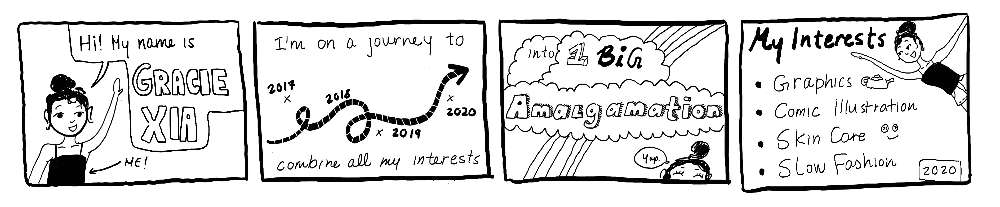

### Welcome to my Github 😊

<!--
**graciexia8/graciexia8** is a ✨ _special_ ✨ repository because its `README.md` (this file) appears on your GitHub profile.

Here are some ideas to get you started:

- 🔭 I’m currently working on ...
- 🌱 I’m currently learning ...
- 👯 I’m looking to collaborate on ...
- 🤔 I’m looking for help with ...
- 💬 Ask me about ...
- 📫 How to reach me: ...
- 😄 Pronouns: ...
- ⚡ Fun fact: ...
-->
 
My name is Gracie and I study software engineering @UWaterloo. I am on a journey to combine all my interests into one big amalgamation. As of this moment, I'm trying to learn more about computer graphics, storytelling through comics, skincare, and sustainable fashion 👯. 
